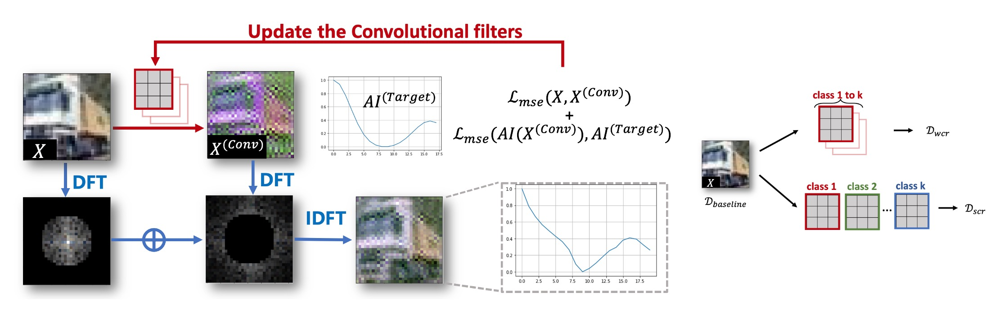

# [Investigating and Explaining the Frequency Bias in Image Classification](https://github.com/zhiyugege/FreqBias) [IJCAI-2022,Oral]

- [Paper link](https://www.ijcai.org/proceedings/2022/0101.pdf)

- If you have any questions about the paper or code, please [contact us](zyllin@bjtu.edu.cn)

## Bias Observations On Learning Priority

- Starting with standard traning by `easy_train.py`
```
# an example of training on cifar10 with resnet18
python easy_train.py --dataset cifar10 --arch resnet18 --gpu 0
```
- Obtaining evolution of gradient spectrum and visualization by `grad.py`
```
python grad.py --dataset cifar10 --arch resnet18 --gpu 0
```

## Bias Hypothesis Ι : Spectral Density

<div align="center">
    
    <p> Convolutional Density Enhancement Strategy (CDES) </p>
</div>

**Hypothesize**: Spectral density can serve as an explanation for frequency bias in image classification tasks. We propose a framework called **Convolutional Density Enhancement Strategy (CDES)** to modify the spectral density of natural images.

- Train toy kernels

Since simply adding noise is difficult to modify the spectral density as we expect, we first propose to perform convolution operations on original images with a set of trainable convolution filters.

```
cd SpectralDensity
python train_toy_models.py --number 16 --kernel_size 7 --cuda_index 0 --weight_decay 1e-4 --momentum 0.9 --epochs 20 --lr 0.01 --step_lr 5 --step_lr_gamma 0.1 --exp_name SCR --batch_size 100 --workers 4
```
*--number* (int): number of convolutional kernels, default 16.

*--kernel_size* (int): size of convolutional kernels, default 7.

*--exp_name* (str): The type of generate dataset. default [SCR, WCR].

- Generate toy datasets
```
cd SpectralDensity
python generate_toy_dataset.py --exp_name SCR --cuda_index 0
```
*--cuda_index* (int): your gpu ids, default 0.

*--exp_name* (str): The type of generate dataset, default [SCR, WCR].


- Visualization of SCR-dataset(take class 0 as an example)
<div align="center">
    
</div>

- Visualization of WCR-dataset
<div align="center">
    
</div>

## Bias Hypothesis ΙΙ :  Class Consistency

- Creating the new dataset called HARS-dataset
```
cd tools
python generate_freq_dataset.py
```
We use `r=12` in the code to control the mixing radius of low frequency and high frequency of different types of images.

- Training model with HARS-dataset
```
python easy_train.py --dataset cifar10 --arch resnet18 --gpu 0 --r 12
```
- Evaluation of model
```
python test.py --dataset cifar10 --arch resnet18 --freq low --r 4
```
*--freq* (str): The frequency component of image, low or high frequencies.

*--r* (int): The frequency radius of spectrum.


For any questions, welcome to contact {**zylin**, **yifeigao**}@bjtu.edu.cn

## References

The code refers to https://github.com/MadryLab/robustness and https://github.com/cc-hpc-itwm/UpConv

## Citation

If you find this repo useful for your research, please consider citing the paper
```
@inproceedings{ijcai2022p101,
  title     = {Investigating and Explaining the Frequency Bias in Image Classification},
  author    = {Lin, Zhiyu and Gao, Yifei and Sang, Jitao},
  booktitle = {Proceedings of the Thirty-First International Joint Conference on
               Artificial Intelligence, {IJCAI-22}},
  publisher = {International Joint Conferences on Artificial Intelligence Organization},
  editor    = {Lud De Raedt},
  pages     = {717--723},
  year      = {2022},
  month     = {7},
  note      = {Main Track},
  doi       = {10.24963/ijcai.2022/101},
  url       = {https://doi.org/10.24963/ijcai.2022/101},
}
```
