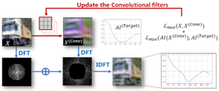
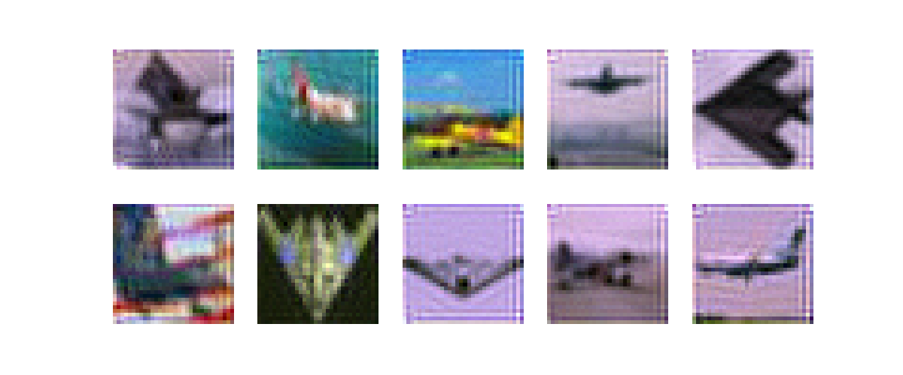

# Investigating and Explaining the Frequency Bias in Image Classification [IJCAI-2022,Oral]

## Bias Observations: On Learning Priority

- Starting with standard traning by `easy_train.py`
```
# an example of training on cifar10 with resnet18
python easy_train.py --dataset cifar10 --arch resnet18 --gpu 0
```
- Obtaining evolution of gradient spectrum and visualization by `grad.py`
```
python grad.py --dataset cifar10 --arch resnet18 --gpu 0
```

## Bias Hypothesis Ι : Spectral Density

<div align="center">
    
    <p> Convolutional Density Enhancement Strategy (CDES) </p>
</div>

**Hypothesize**: Spectral density can serve as an explanation for frequency bias in image classification tasks. We propose a framework called **Convolutional Density Enhancement Strategy (CDES)** to modify the spectral density of natural images.

- Train toy kernels

Since simply adding noise is difficult to modify the spectral density as we expect, we first propose to perform convolution operations on original images with a set of trainable convolution filters.

```
cd SpectralDensity
python train_toy_models.py --number 16 --kernel_size 7 --cuda_index 0 --weight_decay 1e-4 --momentum 0.9 --epochs 20 --lr 0.01 --step_lr 5 --step_lr_gamma 0.1 --exp_name SCR --batch_size 100 --workers 4
```
*--number* (int): number of convolutional kernels, default 16.

*--kernel_size* (int): size of convolutional kernels, default 7.

*--exp_name* (str): The type of generate dataset. default [SCR, WCR].

- Generate toy datasets
```
cd SpectralDensity
python generate_toy_dataset.py --exp_name SCR --cuda_index 0
```
*--cuda_index* (int): your gpu ids, default 0.

*--exp_name* (str): The type of generate dataset, default [SCR, WCR].


- Visualization of SCR-dataset(take class 0 as an example)
<div align="center">
    
</div>

- Visualization of WCR-dataset
<div align="center">
    
</div>
